# Windows 環境構築手順

## 目次

- [Windows 環境構築手順](#windows-環境構築手順)
  - [目次](#目次)
  - [要件](#要件)
  - [1. WSLの有効化](#1-wslの有効化)
  - [2. Ubuntu 24.04をインストール](#2-ubuntu-2404をインストール)
  - [3. Visual Studio Codeをインストール](#3-visual-studio-codeをインストール)
  - [4. Visual Studio CodeからWSL Ubuntuを開く](#4-visual-studio-codeからwsl-ubuntuを開く)
  - [5. リポジトリクローンとDockerのインストール](#5-リポジトリクローンとdockerのインストール)
  - [6. Dockerを開く](#6-dockerを開く)

## 要件

Windows11 25H2、またはそれに近いOSバージョンであること。

## 1. WSLの有効化

スタート画面を開き、「Windowsの機能の有効化または無効化」を入力する。

以下のように項目が表示されるので、「Windowsの機能の有効化または無効化」をクリックして開く。


「Linux 用 Windows サブシステム」をチェックして有効化する。
「Hype-V」をチェックして有効化する。


OKをクリックしてウィンドウを閉じ、PCを再起動する。

次に、WSLを最新に更新する。

スタート画面を開き、「PowerShell」と入力し、「Windows PowerShell」をクリックして開く。


開いたターミナル画面で、以下のコマンドを実行する。

```powershell
wsl --update
```


## 2. Ubuntu 24.04をインストール

スタート画面を開き、「Store」と入力し、「Microsoft Store」を開く。


検索欄にUbuntuと入力し、Ubuntu 24.04 を選択してインストールする。


この時、「Ubuntu 24.04.01 LTS」のように表示されているが、ここは時期によっては「Ubuntu 24.04.02 LTS」となっているかもしれない。

どちらでも問題ないので、「Ubuntu 24.04.~~」をインストールすること。

インストールが終わると、「開く」というボタンが表示されるので、クリックする。

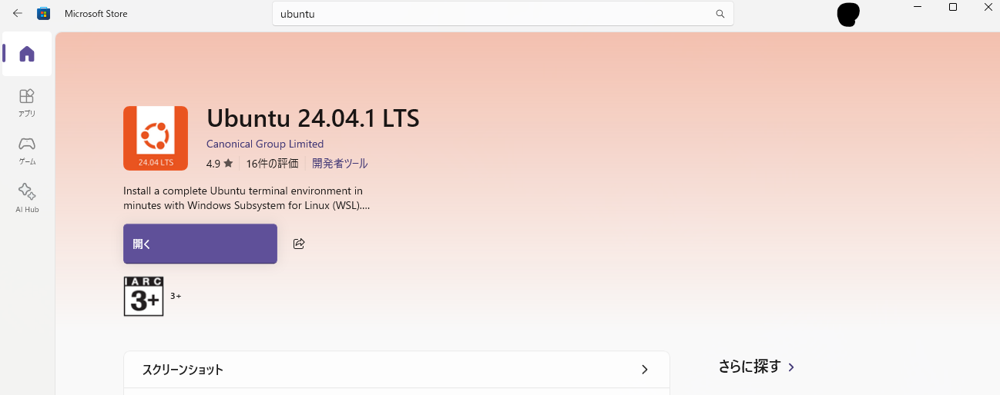

初回起動時は、インストール処理が入るので、待つ。


しばらく待つと、ユーザー名とパスワードの入力を求められる。


自由に決めてよいので、ユーザー名とパスワードを入力する。パスワードは入力しても、画面上には表示されていないので注意。

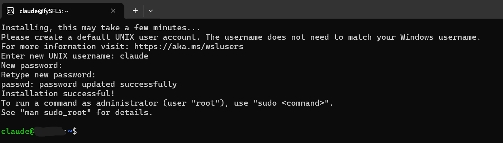

## 3. Visual Studio Codeをインストール

以下のリンク先から、Visual Studio Codeのインストーラをダウンロードしてインストールする。

https://code.visualstudio.com/download

Visual Studio Codeを開き、「Extensions」をクリックし、以下の拡張機能をインストールする。

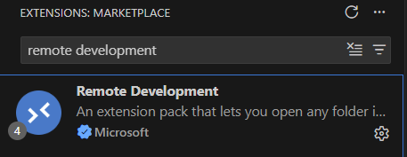

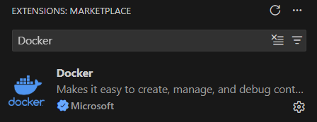

画像のように、検索欄で「Remote Development」、「Docker」を入力すると、項目が現れる。

## 4. Visual Studio CodeからWSL Ubuntuを開く

「Remote Explorer」を開き、

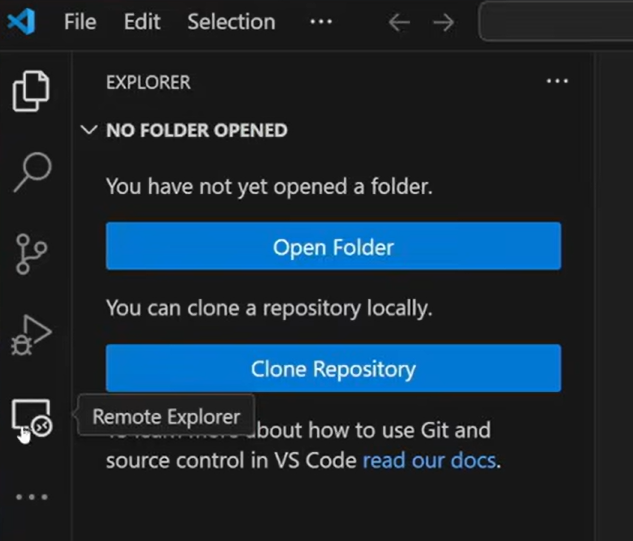

「WSL Targets」を開く。

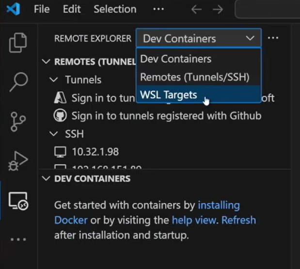

「Ubuntu-24.04」がリストされているので、マウスカーソルを合わせて右矢印をクリックする。

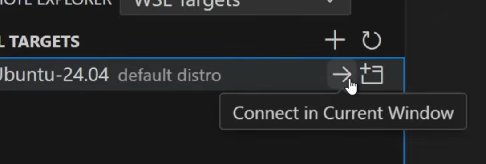

これにより、のWSL Ubuntu環境がVisual Studio Codeで開かれる。左下に「WSL: Ubuntu24.04」と表示されていることを確認する。

## 5. リポジトリクローンとDockerのインストール

Visual Studio Codeのターミナルで、以下のコマンドを実行する。

```bash
git clone https://github.com/Modeling-Coding-Automation-Project/MCAP_repo_manager.git
```

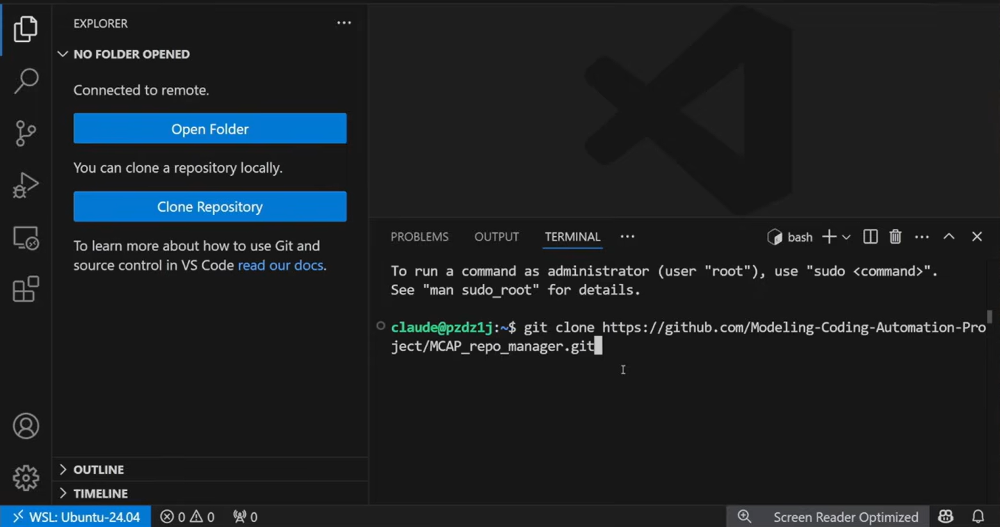

「MCAP_repo_manager」一式がダウンロードされるので、「Open Folder」をクリックしてそのディレクトリを開く。

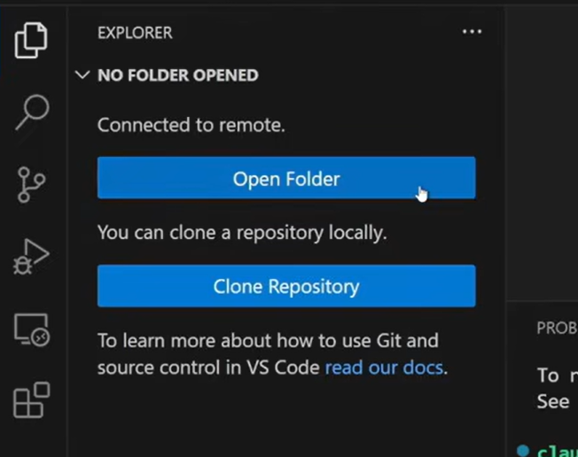

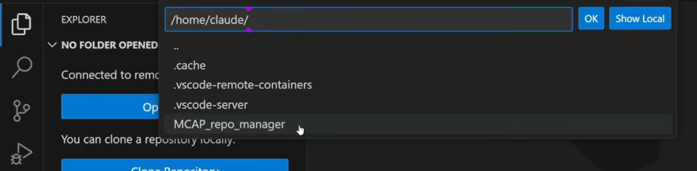

「Do you trust the authors of the files in this folder?」と表示されたら、「Yes, I trust the authors」を選択する。

次に、「docker」フォルダの「install_docker_environment.sh」を実行する。

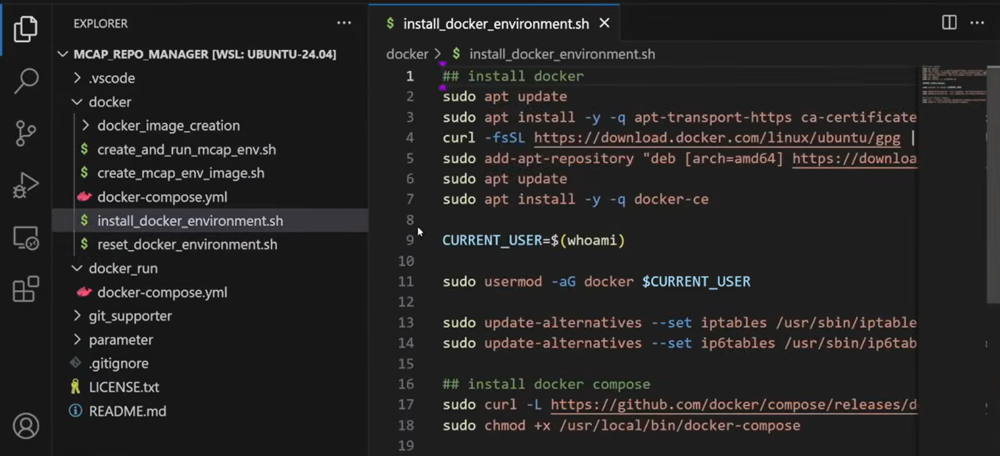

ターミナルを表示し、以下のコマンドを実行する。

```bash
cd ./docker
chmod +x ./*.sh
./install_docker_environment.sh
```

Dockerのインストールが始まる。途中、エンターキーの入力を求められる場合があるので、エンターを押す。

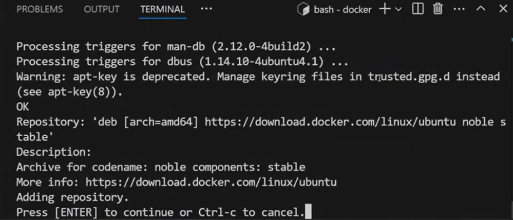

## 6. Dockerを開く

左下の「>< WSL: Ubuntu-24.04」をクリックし、

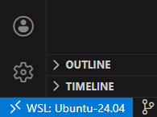

「Reopen in Container」をクリックする。

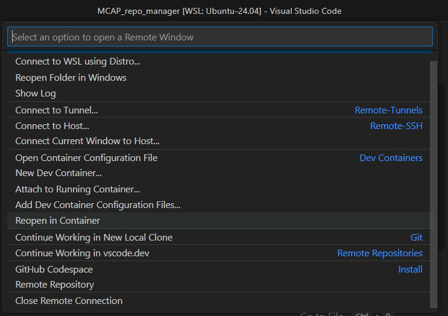
