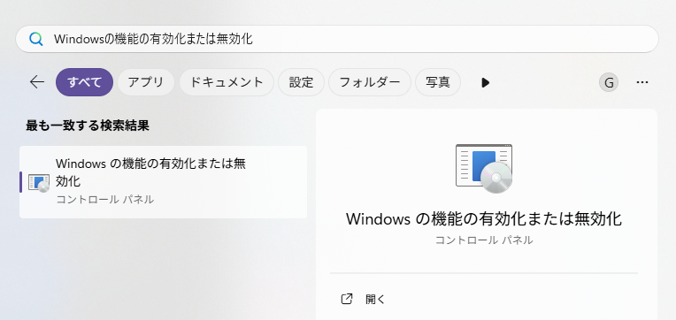
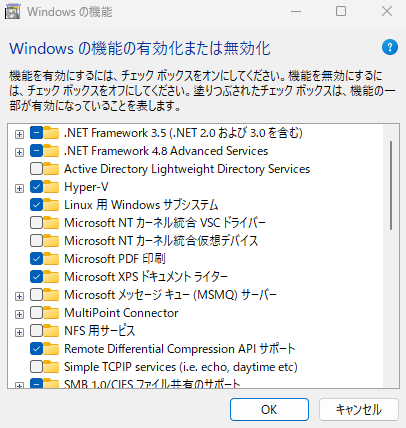
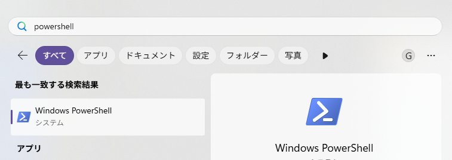

# Windows 環境構築手順

## 目次

- [Windows 環境構築手順](#windows-環境構築手順)
  - [目次](#目次)
  - [要件](#要件)
  - [1. WSLの有効化](#1-wslの有効化)
  - [2. Ubuntu 24.04をインストール](#2-ubuntu-2404をインストール)

## 要件

Windows11 25H2、またはそれに近いOSバージョンであること。

## 1. WSLの有効化

スタート画面を開き、「Windowsの機能の有効化または無効化」を入力する。

以下のように項目が表示されるので、「Windowsの機能の有効化または無効化」をクリックして開く。



「Linux 用 Windows サブシステム」をチェックして有効化する。
「Hype-V」をチェックして有効化する。



OKをクリックしてウィンドウを閉じ、PCを再起動する。

次に、WSLを最新に更新する。

スタート画面を開き、「PowerShell」と入力し、「Windows PowerShell」をクリックして開く。



開いたターミナル画面で、以下のコマンドを実行する。

```powershell
wsl --update
```


## 2. Ubuntu 24.04をインストール

スタート画面を開き、「Store」と入力し、「Microsoft Store」を開く。


検索欄にUbuntuと入力し、Ubuntu 24.04 を選択してインストールする。


この時、「Ubuntu 24.04.01 LTS」のように表示されているが、ここは時期によっては「Ubuntu 24.04.02 LTS」となっているかもしれない。

どちらでも問題ないので、「Ubuntu 24.04.~~」をインストールすること。

インストールが終わると、「開く」というボタンが表示されるので、
